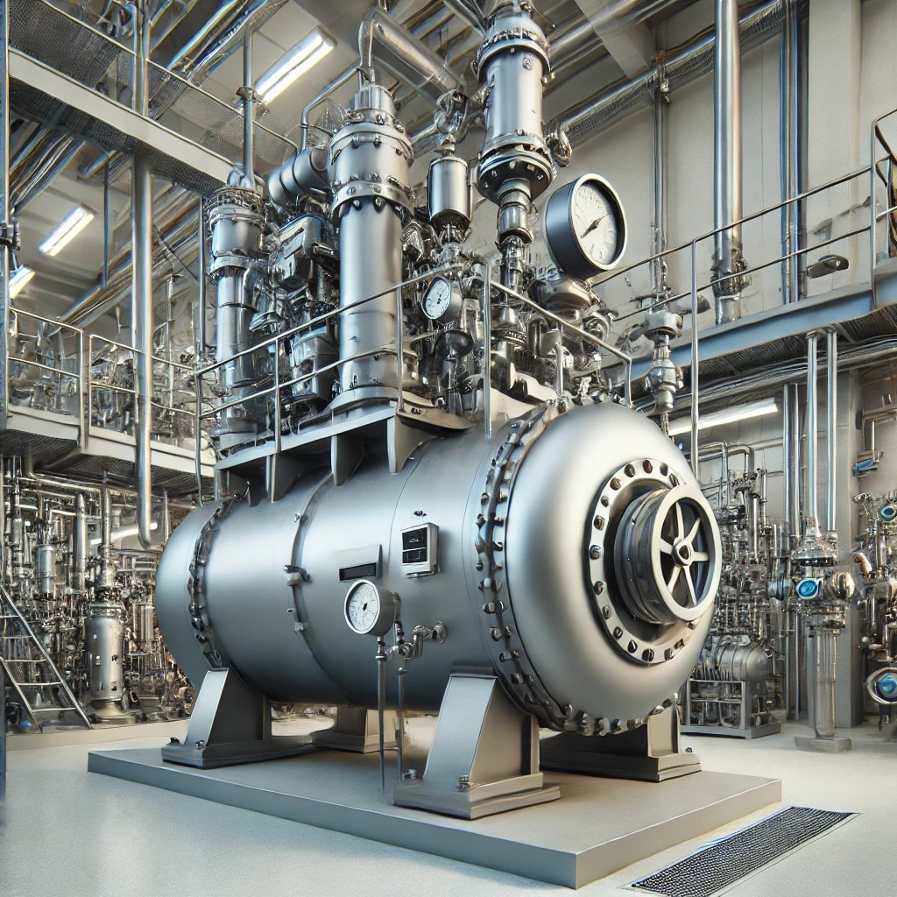
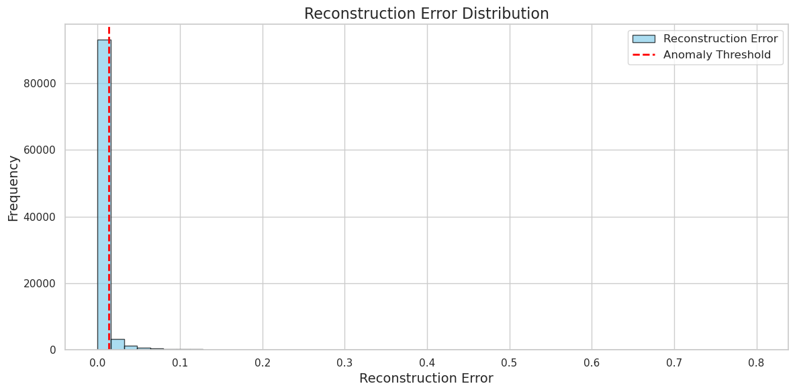
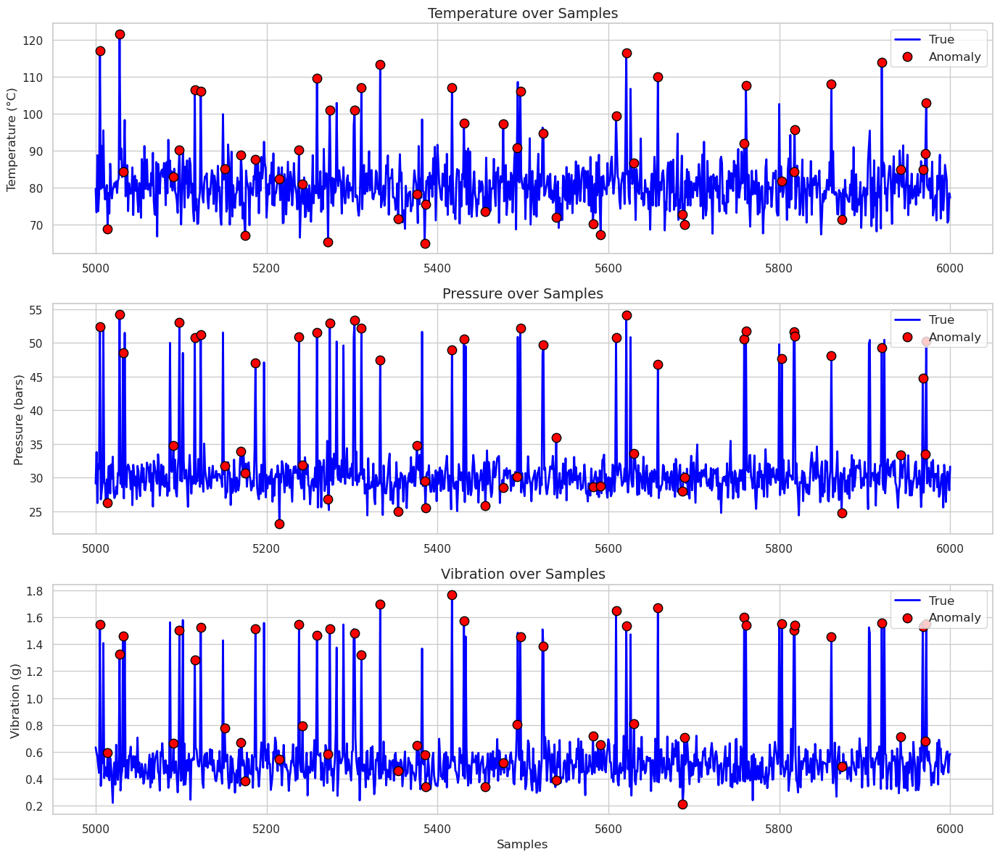

# Anomaly Detection in Compressor System with Autoencoders

## Description

Welcome! This repository contains a notebook that demonstrates how to detect anomalies in time-series data from a **compressor system** using **Autoencoders** with **PyTorch**. The Autoencoder is trained on **normal operational data**, and when it encounters **anomalous data**, it produces a large **reconstruction error**, which helps to identify the anomalies.

<div align="center">

</div>

*Figure 1: An AI-generated image of an industrial compressor created using DALL·E by OpenAI. This image is intended to visually represent the compressor system discussed in the anomaly detection project.*

The Autoencoder is a neural network that tries to learn how to compress (encode) and then reconstruct (decode) the input data. Since it is trained only on normal data, it becomes good at reconstructing **normal behavior** but struggles with data that deviates from the normal patterns, such as faulty or anomalous data.

The reconstruction error is measured by comparing the input data with the reconstructed data. When the reconstruction error exceeds a certain threshold, we flag the input as **anomalous**.

## Software Installation Guide

1. Ensure that you have an appropriate Python environment set up, preferably using **Anaconda** or **virtualenv**. You will also need **Jupyter Notebook** to run the provided notebook.
   
2. Install the required packages by running the following command:

```bash
pip install -r requirements.txt
```

The required libraries include common data science and machine learning tools such as:
- **PyTorch** for building and training the Autoencoder.
- **scikit-learn** for data scaling and basic utilities.
- **matplotlib** and **seaborn** for visualization.


## User Guidelines

1. **Data Preparation**:
   - The notebook begins by generating synthetic data that simulates normal and anomalous operations of a **compressor system**. The dataset includes three key variables: **temperature (°C)**, **pressure (bars)**, and **vibration (g)**.
   - The data is standardized using the **`StandardScaler`** from `scikit-learn` to ensure proper scaling and feature contribution during training.

2. **Concept of Reconstruction**:
   - The **Autoencoder** is designed to learn the normal behavior of the system by compressing and reconstructing the data. When trained on normal data, the autoencoder minimizes the reconstruction error for normal inputs.
   - **Hypothesis**: When the autoencoder encounters **anomalous data**, it will produce a **large reconstruction error** because it has not learned the patterns of the anomalies. This large reconstruction error helps identify the anomalies in the system.
   
   The reconstruction error is calculated as the difference between the input data $X$ and the reconstructed output $\hat{X}$:

   $$\text{Reconstruction Error} = \frac{1}{n} \sum_{i=1}^{n} (X_i - \hat{X_i})^2$$

   Where:
   - $X$ is the original input.
   - $\hat{X}$ is the reconstructed output from the autoencoder.
   - $n$ is the number of features (e.g., temperature, pressure, vibration).

3. **Model Training**:
   - The **Autoencoder** is built using **PyTorch** and trained using only **normal data**.
   - The model is trained with the **Mean Squared Error (MSE)** as the reconstruction loss. Both training and validation losses are monitored to ensure proper learning and avoid overfitting.
   - A **threshold** is set based on the 95th percentile of reconstruction errors for normal data, and any input exceeding this threshold is flagged as anomalous.

4. **Anomaly Detection and Visualization**:
   - After training, the model is used to compute the **reconstruction error** for both normal and anomalous data.
   - The following two plots are generated for a clear understanding of the detection process:
     - **Reconstruction Error Distribution**: This plot shows the distribution of reconstruction errors with the threshold marked. Anomalies can be identified as the points exceeding the threshold.
    
    *Figure 2: Reconstruction error distribution with the anomaly threshold marked in red. Anomalies are identified when the reconstruction error exceeds this threshold.*

     - **Anomalies Detected in Time-Series Data**: This plot visualizes the anomalies over time for each feature (temperature, pressure, and vibration).
    
    *Figure 3: Anomalies detected over time in temperature, pressure, and vibration data. Red points indicate detected anomalies where the reconstruction error exceeded the threshold.*

## Future Improvements

This workflow can be applied to real-world time-series data from sensors or industrial equipment to monitor system performance and detect early signs of failure. Potential future enhancements include:

- **Threshold Optimization**: Using more sophisticated techniques like dynamic thresholds or ensemble methods to improve anomaly detection accuracy.
- **Deployment**: Converting the notebook into a production-ready pipeline with alerting mechanisms in place for real-time anomaly detection.
- **Model Improvements**: Experimenting with more advanced architectures such as **LSTM Autoencoders** for sequential data or introducing **attention mechanisms** for better anomaly detection in complex time series.

## References

1. Blanke, M., Kinnaert, M., Lunze, J., & Staroswiecki, M. (2006). **Diagnosis and Fault-Tolerant Control**. Springer.
2. Chandola, V., Banerjee, A., & Kumar, V. (2009). **Anomaly Detection: A Survey**. ACM Computing Surveys (CSUR), 41(3), 1-58.
3. Marchi, E., Vesperini, F., Eyben, F., Squartini, S., & Schuller, B. (2015). **A Novel Approach for Automatic Acoustic Novelty Detection Using a Denoising Autoencoder with Bidirectional LSTM Neural Networks**. ICASSP.
4. Yin, S., Ding, S. X., Xie, X., & Luo, H. (2014). **A Review on Basic Data-Driven Approaches for Industrial Process Monitoring**. IEEE Transactions on Industrial Electronics, 61(11), 6418-6428.